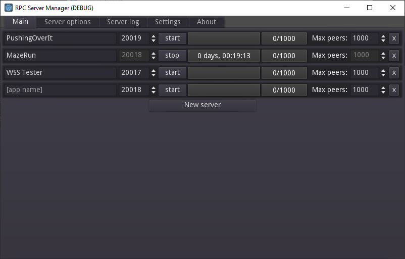
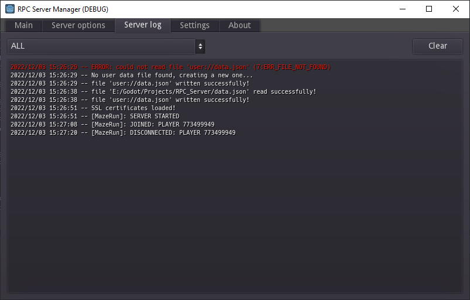
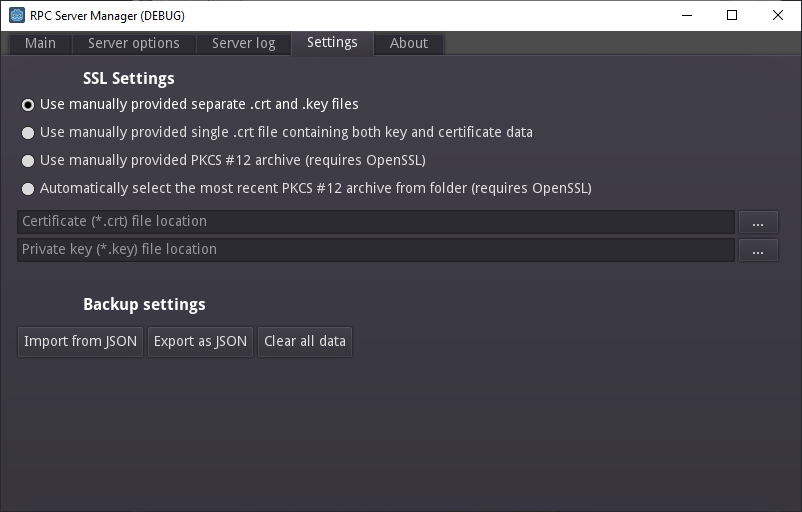

# Godot RPC Server Manager

Simple app I made for managing and monitoring multiple RPC servers in a single window so I don't have to keep a full instance of every game open.

Works with both standard (ENet) and websocket connections as well as with SSL enabled, so it can be useful for testing secure connections and HTML5 based games.

Made in **Godot v3.3**.

**NOTE**: RPC with Godot is *really* not designed to work this way -- the node tree is meant to be fully symmetric with the clients for performance reasons, and the console WILL scream at you in debug mode! I have not tested with huge numbers of users and it's really just a hacky way to have servers running without the game running. I take no responsibility for any damage, use as you see fit!

(Works on Windows, have not tested on Linux.)
